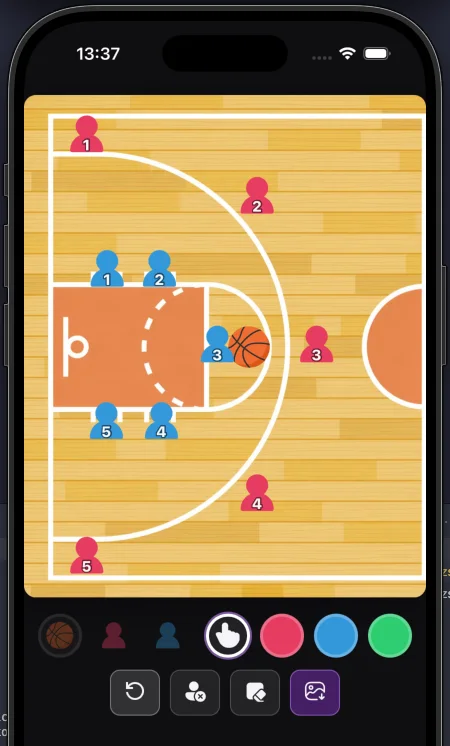

# Tactical Board

Веб-доска для разметки баскетбольных схем на половине площадки: игроки, мяч и линии движения. Работает в браузере, удобно с телефона.

- **Мяч** — поставить мяч.
- **Игроки** — добавить красного или синего.
- **Палец** — таскать фигуры по полю.
- **Кружки цвета** — рисовать линии движения.
- **Круговая стрелка** — сброс к стандартной расстановке.
- **Игрок с крестом** — убрать все фигуры с поля.
- **Ластик** — очистить только рисунок.
- **Сохранить** — скачать PNG.
